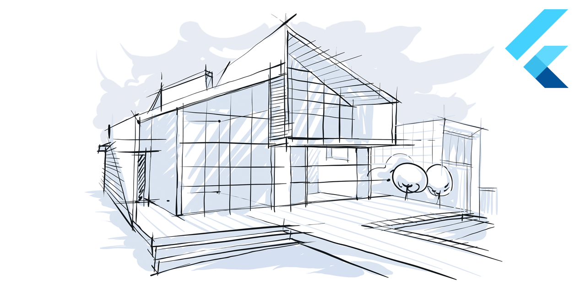

# **4Dev Flutter - Enquetes para Programadores**

---

## [**Link para o curso completo**](https://www.udemy.com/course/flutter-com-mango/?referralCode=4595D68027AC351A7454)

Essa aplicativo faz parte do treinamento do professor Rodrigo Manguinho (Mango) na Udemy.

O objetivo do treinamento é mostrar como criar um aplicativo com Flutter usando uma arquitetura bem definida e desacoplada, seguindo TDD (programação orientada a testes) como metodologia de trabalho, Clean Architecture para fazer a distribuição de responsabilidades em camadas, sempre seguindo os princípios do SOLID e aplicando Design Patterns para resolver alguns problemas comuns.
  

## Contribua com esse Projeto <3

 

## [**Link para a documentação da API**](http://fordevs.herokuapp.com/api-docs)

> ## Princípios

* Single Responsibility Principle (SRP)
* Open Closed Principle (OCP)
* Liskov Substitution Principle (LSP)
* Interface Segregation Principle (ISP)
* Dependency Inversion Principle (DIP)
* Separation of Concerns (SOC)
* Don't Repeat Yourself (DRY)
* You Aren't Gonna Need It (YAGNI)
* Keep It Simple, Silly (KISS)
* Command Query Responsibility Segregation (CQRS)
* Composition Over Inheritance
* Small Commits

> ## Design Patterns

* Factory
* Adapter
* Composite
* Decorator
* Dependency Injection
* Abstract Server
* Composition Root
* Builder
* Singleton
* Observer
* Strategy
* AAA (Arrange, Act, Assert)

> ## Metodologias e Designs

* TDD
* BDD
* Clean Architecture
* Reactive Programming
* GitFlow
* Modular Design
* Dependency Diagrams
* Use Cases

> ## Bibliotecas e Ferramentas

* Flutter
* Flutter Version Management
* Http
* Provider
* GetX
* Equatable
* Mockito
* Mocktail
* Faker
* Meta
* Git
* Flutter Secure Storage
* LocalStorage
* i18n
* Image Test Utils
* Network Image Mock

> ## Features do Dart/Flutter
* Null Safety
* Classes
* Abstract Classes
* Functions
* Constants
* Mixins
* Extensions
* Enums
* Exceptions
* Futures
* Streams
* Constructors
* Async/Await
* Stateless Widgets
* Stateful Widgets
* Material Theme
* Assets
* App Icon

> ## Features de Testes

* Testes Unitários
* Testes de Widgets
* Testes de Streams
* Testes de Integração
* Cobertura de Testes
* Test Doubles
* Mocks
* Stubs
* Spies